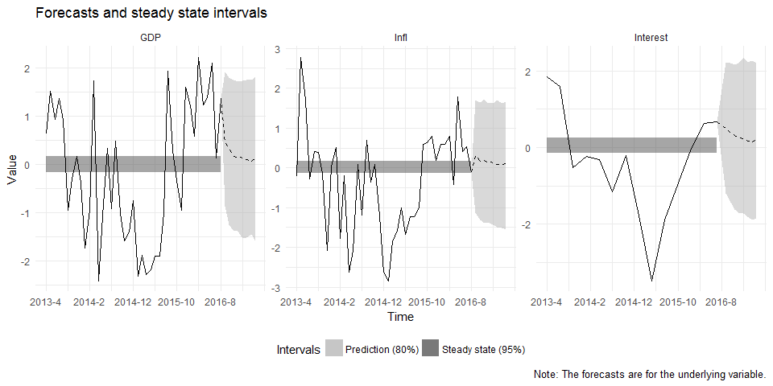

<!-- README.md is generated from README.Rmd. Please edit that file -->
First, we generate some dummy data as a VAR(1) with three variables whose uncondtional means are all zero.

``` r
library(mfbvar)
TT <- 200
n_vars <- 3
set.seed(100)

Y <- matrix(0, 2*TT, n_vars)
Phi <- matrix(c(0.3, 0.1, 0.2, 0.3, 0.3, 0.6, 0.2, 0.2, 0.3), 3, 3)
for (i in 2:(2*TT)) {
  Y[i, ] <- Phi %*% Y[i-1,] + rnorm(n_vars)
}
Y[, n_vars] <- zoo::rollapply(Y[, n_vars], 3, mean, fill = NA, align = "right")
Y <- Y[-(1:TT),]
Y[setdiff(1:TT, seq(1, TT, 3)), n_vars] <- NA

dates <- paste(rep(2000:2016, each = 12), "-", 1:12, sep = "")
Y <- as.data.frame(Y)
rownames(Y) <- dates[1:nrow(Y)]
colnames(Y) <- c("GDP", "Infl", "Interest")
```

The data now looks like this:

``` r
head(Y)
#>               GDP        Infl    Interest
#> 2000-1 -1.1989678 -0.75702100 -0.09451455
#> 2000-2  1.6678454 -0.03918286          NA
#> 2000-3  0.9703378  0.66586254          NA
#> 2000-4  0.7510579 -0.86952165 -1.25415332
#> 2000-5 -1.3778672 -0.30070349          NA
#> 2000-6 -2.8815800 -2.77209277          NA
```

The names are, of course, made up, but this is to illustrate how the names are used later on.

We next need to make some settings for the estimation:

``` r
n_burnin <- 2000
n_reps <- 2000
n_fcst <- 8
n_lags <- 4
n_vars <- ncol(Y)
n_T <- nrow(Y)
```

The `n_*` variables are self-explanatory. Next, create the matrix of deterministic terms (also for the forecasting period):

``` r
d <- matrix(1, nrow = n_T, ncol = 1)
d_fcst <- matrix(1, nrow = n_fcst, ncol = 1)
```

For the prior on the dynamic coefficients and the error covariance matrix, we need to set the prior degrees of freedom as well as the prior mean of AR(1) coefficients and the tuning parameters:

``` r
prior_nu <- n_vars + 2 
prior_Pi_AR1 <- c(0, 0, 0) 
lambda1 <- 0.1
lambda2 <- 1
```

The prior on the steady states also needs to be set:

``` r
prior_psi_mean <- c(0, 0, 0) 
prior_psi_Omega <- c(0.5, 0.5, 0.5) 
prior_psi_Omega <- diag((prior_psi_Omega / (qnorm(0.975, mean = 0, sd = 1)*2))^2) 
```

The third line simply converts the length of the prior interval to the variance in a normal distribution.

Finally, we also need to create the matrix that relates unobservables to observables. In this example, the first two variables are assumed to be observed every period, whereas the third is assumed to be observed every third time period. Moreover, when it is observed, we observe the average over three periods. This can be specified using the `build_Lambda()` function:

``` r
Lambda <- build_Lambda(c("identity", "identity", "average"), n_lags)
```

After having set these preliminary variables, we can now call the main function `mfbvar()`:

``` r
set.seed(10238)
mfbvar_obj <- mfbvar(Y, d, d_fcst, Lambda, prior_Pi_AR1, lambda1, lambda2, 
                     prior_nu, prior_psi_mean, prior_psi_Omega, 
                     n_lags, n_fcst, n_burnin, n_reps) 
```

Four S3 methods are implemented:

``` r
mfbvar_obj
#> Mixed-frequency steady-state BVAR with:
#> 3 variables (GDP, Infl, Interest)
#> 4 lags
#> 200 time periods (2000-1 - 2016-8)
#> 8 periods forecasted
#> 2000 draws used in main chain
summary(mfbvar_obj)
#> Mixed-frequency steady-state BVAR with:
#> 3 variables (GDP, Infl, Interest)
#> 4 lags
#> 200 time periods (2000-1 - 2016-8)
#> 8 periods forecasted
#> 2000 draws used in main chain
predict(mfbvar_obj)
#> $quantile_10
#>               GDP       Infl   Interest
#> 2016-5  1.3803177  1.7876094 -0.2982678
#> 2016-6  2.1033306  0.4081949 -0.4700904
#> 2016-7  0.1380393  0.5336616 -0.6610080
#> 2016-8  1.3671916 -0.1190409 -0.9798038
#> fcst_1 -0.9077935 -1.1484907 -1.2692016
#> fcst_2 -1.2808523 -1.2068750 -1.4042869
#> fcst_3 -1.4087215 -1.3412728 -1.5562718
#> fcst_4 -1.3998371 -1.4643889 -1.6518898
#> fcst_5 -1.4664897 -1.3668879 -1.7629637
#> fcst_6 -1.4766954 -1.4881812 -1.7413853
#> fcst_7 -1.5041913 -1.5068836 -1.8392972
#> fcst_8 -1.5134278 -1.5300273 -1.9253591
#> 
#> $quantile_50
#>               GDP        Infl   Interest
#> 2016-5 1.38031772  1.78760935 0.89878821
#> 2016-6 2.10333061  0.40819491 0.64212809
#> 2016-7 0.13803932  0.53366160 0.46528528
#> 2016-8 1.36719159 -0.11904092 0.51108586
#> fcst_1 0.45984521  0.22179253 0.51124243
#> fcst_2 0.22970431  0.24068832 0.44629752
#> fcst_3 0.19115922  0.16936410 0.30777191
#> fcst_4 0.20533249  0.12722670 0.34655705
#> fcst_5 0.10486670  0.10235430 0.25268044
#> fcst_6 0.10558927  0.15984026 0.22178988
#> fcst_7 0.04731388  0.09228882 0.16919913
#> fcst_8 0.06204184  0.01160053 0.08209229
#> 
#> $quantile_90
#>              GDP       Infl Interest
#> 2016-5 1.3803177  1.7876094 2.055198
#> 2016-6 2.1033306  0.4081949 1.794849
#> 2016-7 0.1380393  0.5336616 1.595688
#> 2016-8 1.3671916 -0.1190409 2.037312
#> fcst_1 1.8501138  1.6460544 2.207240
#> fcst_2 1.7752781  1.6362246 2.217468
#> fcst_3 1.7922323  1.6192516 2.229205
#> fcst_4 1.8111177  1.6583651 2.208675
#> fcst_5 1.7522258  1.6799562 2.199071
#> fcst_6 1.7066145  1.6016092 2.226054
#> fcst_7 1.7722307  1.5530425 2.263806
#> fcst_8 1.6925069  1.6557754 2.159732
plot(mfbvar_obj)
```


