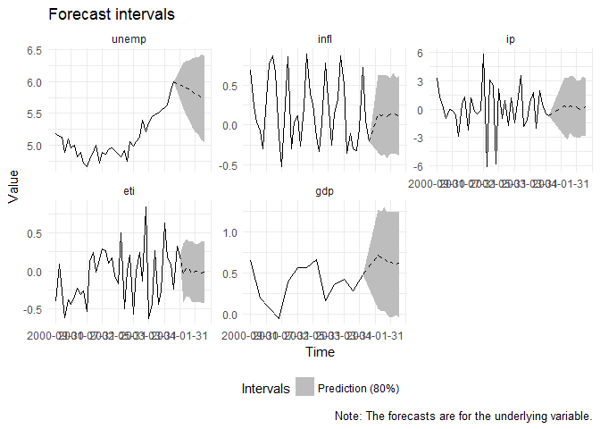
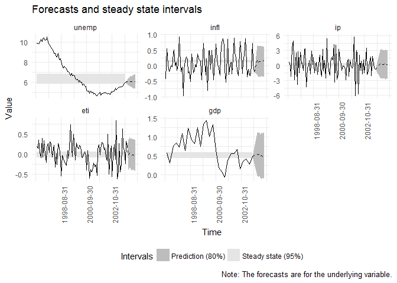

mfbvar
======

[](https://travis-ci.org/ankargren/mfbvar) [](http://www.r-pkg.org/pkg/mfbvar) [](https://codecov.io/github/ankargren/mfbvar?branch=master)

Overview
--------

The `mfbvar` package implements a steady-state prior and a Minnesota prior for state space-based mixed-frequency VAR models. <!-- README.md is generated from README.Rmd. Please edit that file -->

### Prior specification

First, obtain some data stored in the package.

``` r
library(mfbvar)
Y <- mf_sweden
head(Y)
#>            unemp        infl         ip         eti       gdp
#> 1996-08-31   9.9 -0.44997116  0.5941788  0.19536978        NA
#> 1996-09-30   9.8  0.56804886 -1.5522700  0.08309475 0.4704331
#> 1996-10-31   9.8  0.03539614 -0.4825100  0.26642772        NA
#> 1996-11-30   9.9 -0.20074400  1.3213405  0.07019829        NA
#> 1996-12-31  10.1 -0.15378249  2.7076404 -0.06840048 0.7567702
#> 1997-01-31  10.0 -0.01183922  0.3478264  0.31459737        NA
tail(Y)
#>            unemp        infl         ip         eti      gdp
#> 2015-07-31   7.3  0.02895613 -3.1285137  0.09746577       NA
#> 2015-08-31   7.0 -0.19319944  3.8446293  0.16136658       NA
#> 2015-09-30   7.3  0.39565793  0.9132484  0.23165768 0.843138
#> 2015-10-31   7.2  0.07701935         NA  0.16152144       NA
#> 2015-11-30    NA          NA         NA -0.17872172       NA
#> 2015-12-31    NA          NA         NA  0.33933697       NA
```

Next, we create a minimal prior object. We must specify: 1) data, 2) the frequency of the data, 3) the number of lags, 4) the length of burn-in and main chains, respectively. This is done by calling the `set_prior()` function and giving named arguments. The resulting object is of class `mfbvar_prior` and has a basic `print` method.

``` r
prior_obj <- set_prior(Y = Y, freq = c(rep("m", 4), "q"), 
                       n_lags = 4, n_burnin = 1000, n_reps = 1000)
#> Warning: prior_Pi_AR1: Using 0 as prior mean for AR(1) coefficients for all variables.
#> Warning: lambda1: Using the default 0.2 as the value for the overall tightness hyperparameter.
#> Warning: lambda2: Using the default 1 as the value for the lag decay hyperparameter.
#> Warning: lambda3: Using the default 10000 as the constant's prior variance.
#> Warning: prior_nu: Using the default n_vars + 2 = 7 prior for prior_nu.
#> Warning: n_fcst: Using the default 0 for the number of forecasts to compute.
```

Warnings are produced because we haven't specified values for some of the prior elements and instead the function uses default values.

There is a print method for the prior object, showing some basic information:

``` r
prior_obj
#> The following elements of the prior have not been set: 
#>  d d_fcst prior_psi_mean prior_psi_Omega
#> 
#> Checking if steady-state prior can be run... FALSE
#>  Missing elements: d prior_psi_mean prior_psi_Omega 
#> Checking if Minnesota prior can be run... TRUE
```

The message tells us what elements of the prior have not yet been set, and if each of the two priors can be run with the current specification. The check is very minimal; the steady-state prior cannot be used to make forecasts (which it will attempt to if `n_fcst` is greater than `0`) unless also `d_fcst` is given, but to run the model with no forecasts only the three indicated elements are missing.

The summary method provides a little bit more detail:

``` r
summary(prior_obj)
#> PRIOR SUMMARY
#> ----------------------------
#> Required elements:
#>   Y: 5 variables, 233 time points
#>   freq: m m m m q 
#>   prior_Pi_AR1: 0 0 0 0 0 
#>   lambda1: 0.2 
#>   lambda2: 1 
#>   n_lags: 4 
#>   n_fcst: 0 
#>   n_burnin: 1000 
#>   n_reps: 1000 
#>   prior_nu: 7 
#> ----------------------------
#> Steady-state-specific elements:
#>   d: <missing> 
#>   d_fcst: <missing> 
#>   prior_psi_mean: <missing> 
#>   prior_psi_Omega: <missing> 
#> ----------------------------
#> Minnesota-specific elements:
#>   lambda3: 10000 
#> ----------------------------
#> Other:
#>   verbose: FALSE 
#>   smooth_state: FALSE 
#>   check_roots: TRUE
```

### Model estimation

As the print method told us before, we can run the Minnesota prior, but not the steady-state prior with the current prior specification. The model is estimated by calling `estimate_mfbvar()`.

``` r
mod_minn <- estimate_mfbvar(mfbvar_prior = prior_obj, prior_type = "minn")
```

To use the steady-state prior, we need to specify `d`, `prior_psi_mean` and `prior_psi_Omega`. We specify the prior moments for *ψ* using the helper function `interval_to_moments()` which converts 95 % prior probability intervals to prior moments, assuming independence.

``` r
prior_intervals <- matrix(c( 6,   7,
                             0.1, 0.2,
                             0,   0.5,
                            -0.5, 0.5,
                             0.4, 0.6), ncol = 2, byrow = TRUE)
psi_moments <- interval_to_moments(prior_intervals)
prior_psi_mean <- psi_moments$prior_psi_mean
prior_psi_Omega <- psi_moments$prior_psi_Omega
```

Instead of creating a new prior object, we can update the old by use of the `update_prior()` function. Note also that it is possible to specify `"intercept"` for `d` rather than a matrix containing a constant for the deterministic term.

``` r
prior_obj <- update_prior(prior_obj, d = "intercept", prior_psi_mean = prior_psi_mean, 
                          prior_psi_Omega = prior_psi_Omega)
prior_obj
#> The following elements of the prior have not been set: 
#>  d_fcst
#> 
#> Checking if steady-state prior can be run... TRUE
#> 
#> Checking if Minnesota prior can be run... TRUE
```

It is now possible to estimate the model using the steady-state prior.

``` r
mod_ss <- estimate_mfbvar(prior_obj, "ss")
```

It is also allowed to temporarily override elements in the prior object by adding them as separate arguments to the `estimate_mfbvar()` function. Thus, to get forecasts eight steps ahead we would use:

``` r
mod_minn <- estimate_mfbvar(prior_obj, "minn", n_fcst = 8)
mod_ss <- estimate_mfbvar(prior_obj, "ss", n_fcst = 8)
```

### Processing results

The resulting objects contain all of the posterior information. The returned objects from `estimate_mfbvar()` are of class `mfbvar` and `mfbvar_ss` or `mfbvar_minn`.

``` r
class(mod_minn)
#> [1] "mfbvar"      "mfbvar_minn"
class(mod_ss)
#> [1] "mfbvar"    "mfbvar_ss"
```

For forecasts, there is a `predict` method for class `mfbvar` which computes forecasts for selected quantiles. By default, it returns the 10%, 50% and 90% quantiles.

``` r
predict(mod_minn, pred_quantiles = 0.5)
#> $quantile_50
#>           unemp      infl          ip          eti       gdp
#> fcst_1 5.932417 0.1242155  0.33405061 -0.050022658 0.7117655
#> fcst_2 5.898960 0.1175522  0.06041054  0.037579127 0.6822818
#> fcst_3 5.882167 0.1236223  0.33997350  0.016596006 0.6806909
#> fcst_4 5.837747 0.1073888  0.20736734 -0.036096729 0.6378865
#> fcst_5 5.808209 0.1363801  0.19319458  0.001955581 0.6325098
#> fcst_6 5.787979 0.1357397 -0.04254477 -0.003149895 0.6204564
#> fcst_7 5.749631 0.1309146  0.15718252 -0.023760693 0.6118685
#> fcst_8 5.732685 0.1135111  0.27542829 -0.017823715 0.6263529
```

If desired, it can be requested in a tidy format.

``` r
head(predict(mod_minn, pred_quantiles = 0.5, tidy = TRUE))
#>      value fcst_date variable quantile
#> 1 5.932417    fcst_1    unemp      0.5
#> 2 5.898960    fcst_2    unemp      0.5
#> 3 5.882167    fcst_3    unemp      0.5
#> 4 5.837747    fcst_4    unemp      0.5
#> 5 5.808209    fcst_5    unemp      0.5
#> 6 5.787979    fcst_6    unemp      0.5
```

Calling plot on `mfbvar_ss` or `mfbvar_minn` objects produces plots of the forecasts and, by default, `5*n_fcst` of the preceding values.

``` r
plot(mod_minn)
```



The axis tick labels are too long and overlap. The `plot()` method returns a `ggplot`. Hence, modifying the plot simply amounts to adding layers in the usual `ggplot2` way. The method also allows for changing where the plot should begin.

``` r
library(ggplot2)
plot(mod_ss, plot_start = 1) +
  theme(axis.text.x = element_text(angle = 90))
```



There are also some basic `print` and `summary` methods for the two classes implemented.

``` r
mod_minn
#> Mixed-frequency Minnesota BVAR with:
#> 5 variables (unemp, infl, ip, eti, gdp)
#> 4 lags
#> 90 time periods (1996-08-31 - 2004-01-31)
#> 8 periods forecasted
#> 1000 draws used in main chain
mod_ss
#> Mixed-frequency steady-state BVAR with:
#> 5 variables (unemp, infl, ip, eti, gdp)
#> 4 lags
#> 90 time periods (1996-08-31 - 2004-01-31)
#> 8 periods forecasted
#> 1000 draws used in main chain
summary(mod_minn)
#> Mixed-frequency Minnesota BVAR with:
#> 5 variables (unemp, infl, ip, eti, gdp)
#> 4 lags
#> 90 time periods (1996-08-31 - 2004-01-31)
#> 8 periods forecasted
#> 1000 draws used in main chain
#> 
#> #########################
#> Posterior means computed
#> 
#> Pi:
#>        indep
#> dep         unemp.1       infl.1         ip.1      eti.1       gdp.1
#>   unemp  0.69882029 -0.046999528  0.001055781 0.10895689 -0.05313576
#>   infl  -0.04037367  0.125003988 -0.011184563 0.12392106 -0.06144260
#>   ip    -0.25786500  0.092144181 -0.335536522 0.43902925 -0.64287426
#>   eti    0.14255480 -0.044372439  0.007768003 0.02307268  0.14157553
#>   gdp   -0.05879626  0.004800229 -0.010405812 0.14959059  0.24689299
#>        indep
#> dep         unemp.2       infl.2          ip.2        eti.2       gdp.2
#>   unemp  0.20531830  0.008344704 -0.0008531472  0.041171708 -0.05376916
#>   infl   0.05026948 -0.163793123 -0.0102022500 -0.095864583 -0.06347415
#>   ip     0.30250962 -0.091705427 -0.1285325272  0.528961809  0.24009066
#>   eti   -0.03523591 -0.046370334  0.0001882438 -0.005153422  0.02352973
#>   gdp    0.04880938 -0.020055768 -0.0033649254  0.093597253  0.08903906
#>        indep
#> dep         unemp.3       infl.3          ip.3       eti.3        gdp.3
#>   unemp  0.07907799 -0.003544739 -0.0014755137 0.008687738 -0.042044766
#>   infl   0.02289047 -0.049943873  0.0063443093 0.030519525 -0.004646188
#>   ip     0.28215237  0.221429312 -0.0066930031 0.143338406  0.156771970
#>   eti   -0.05996331  0.002373251  0.0023419260 0.092121720 -0.005693020
#>   gdp    0.05832633 -0.016034663  0.0005445953 0.058531733  0.084309614
#>        indep
#> dep          unemp.4       infl.4          ip.4        eti.4       gdp.4
#>   unemp -0.004836518 -0.015122126  0.0014025766  0.013636313 -0.02867925
#>   infl  -0.050849921 -0.062714476 -0.0029779393 -0.007620314 -0.01941282
#>   ip    -0.206863439 -0.007709135  0.0049483467  0.120783469  0.07472288
#>   eti   -0.038986482 -0.005899539 -0.0001383483 -0.025479792 -0.01976436
#>   gdp    0.003756333 -0.020930195 -0.0009608668  0.032528397  0.03577435
#> 
#> 
#> Sigma:
#>        
#>                unemp          infl           ip         eti         gdp
#>   unemp 0.0366985467  0.0002788984  0.012208116 0.003397183 0.003907952
#>   infl  0.0002788984  0.1214639321 -0.011528466 0.020780220 0.005988035
#>   ip    0.0122081162 -0.0115284664  4.120813123 0.001619788 0.282039518
#>   eti   0.0033971832  0.0207802203  0.001619788 0.074453192 0.008712616
#>   gdp   0.0039079524  0.0059880345  0.282039518 0.008712616 0.173213021
#> 
#> 
#> Intercept:
#>             const
#> unemp  0.20937775
#> infl   0.34511609
#> ip    -0.38918625
#> eti   -0.13264149
#> gdp    0.03779578
summary(mod_ss)
#> Mixed-frequency steady-state BVAR with:
#> 5 variables (unemp, infl, ip, eti, gdp)
#> 4 lags
#> 90 time periods (1996-08-31 - 2004-01-31)
#> 8 periods forecasted
#> 1000 draws used in main chain
#> 
#> #########################
#> Posterior means computed
#> 
#> Pi:
#>        indep
#> dep         unemp.1       infl.1          ip.1      eti.1       gdp.1
#>   unemp  0.71286552 -0.036499268  0.0007607514 0.10927021 -0.04950236
#>   infl  -0.04070685  0.125408396 -0.0112064312 0.12700434 -0.07370061
#>   ip    -0.36015728  0.161323073 -0.3387618957 0.48595723 -0.72470568
#>   eti    0.14204810 -0.053285757  0.0074638118 0.02422809  0.11570890
#>   gdp   -0.07250080 -0.005418391 -0.0120068810 0.08008436  0.32111905
#>        indep
#> dep         unemp.2      infl.2          ip.2        eti.2       gdp.2
#>   unemp  0.20411526  0.01238985 -0.0004090247  0.039053945 -0.06452818
#>   infl   0.05810165 -0.15907048 -0.0097052517 -0.092866934 -0.07066901
#>   ip     0.40092935 -0.09352660 -0.1255313118  0.536412728  0.29653031
#>   eti   -0.03747501 -0.04721997  0.0011842459 -0.004681583  0.02681872
#>   gdp    0.05069388 -0.05038300 -0.0051233105  0.064795640  0.11715376
#>        indep
#> dep         unemp.3        infl.3          ip.3      eti.3        gdp.3
#>   unemp  0.07467129 -2.406241e-03 -0.0008603428 0.01028861 -0.046861231
#>   infl   0.01489495 -4.998057e-02  0.0067115064 0.03190304  0.001190236
#>   ip     0.27678204  2.142072e-01 -0.0025546769 0.13705844  0.136883682
#>   eti   -0.05533966 -1.133335e-06  0.0023485709 0.10374953  0.001679271
#>   gdp    0.05343713 -2.425601e-02  0.0003083393 0.06867388  0.079547320
#>        indep
#> dep         unemp.4       infl.4          ip.4        eti.4       gdp.4
#>   unemp -0.01406677 -0.014457646  0.0012851526  0.013883852 -0.03148615
#>   infl  -0.05035010 -0.066976586 -0.0027879693 -0.009868058 -0.02543070
#>   ip    -0.19222840 -0.018381867  0.0039967156  0.108332049  0.08574636
#>   eti   -0.04031512 -0.006333774 -0.0000434808 -0.023971987 -0.02486056
#>   gdp    0.01805438 -0.022100087 -0.0011782783  0.025063738  0.03178088
#> 
#> 
#> Sigma:
#>        
#>                 unemp          infl           ip          eti
#>   unemp  0.0351361477  0.0002253274  0.015968135  0.003207194
#>   infl   0.0002253274  0.1143582525 -0.009767229  0.020088427
#>   ip     0.0159681350 -0.0097672285  3.823333086 -0.001764787
#>   eti    0.0032071938  0.0200884269 -0.001764787  0.071182166
#>   gdp   -0.0001989986  0.0148465639  0.259770699  0.014592485
#>        
#>                   gdp
#>   unemp -0.0001989986
#>   infl   0.0148465639
#>   ip     0.2597706991
#>   eti    0.0145924851
#>   gdp    0.1449128840
#> 
#> 
#> Psi:
#>               d1
#> unemp  6.3143643
#> infl   0.1424652
#> ip     0.2012369
#> eti   -0.0133266
#> gdp    0.5130409
```

### Marginal data density estimation

To estimate the marginal data density, there is a generic function `mdd()` for which there are methods for classes `mfbvar_ss` and `mfbvar_minn`.

``` r
mdd_minn <- mdd(mod_minn)
mdd_ss_1 <- mdd(mod_ss)
mdd_ss_2 <- mdd(mod_ss, p_trunc = 0.5)

mdd_minn
#> [1] 6.910481
mdd_ss_1
#> [1] -337.9066
mdd_ss_2
#> [1] -338.1272
```
