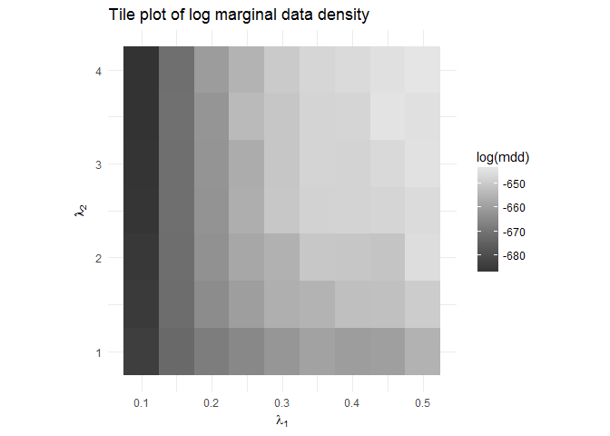
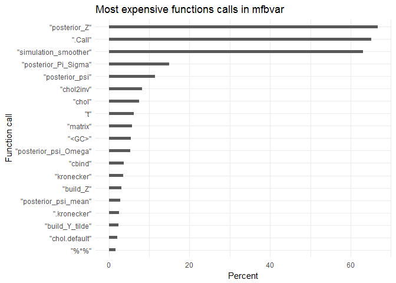
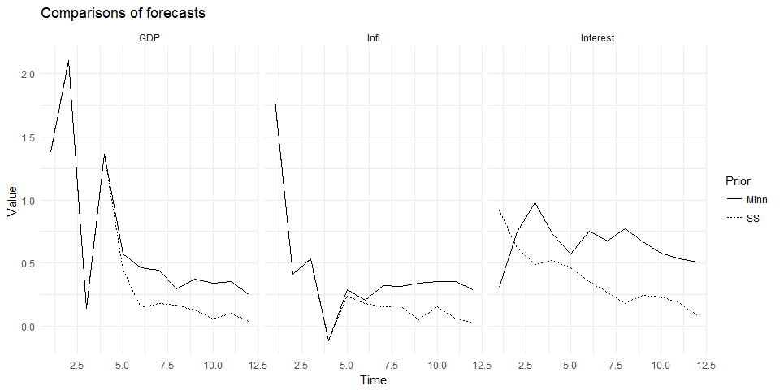

mfbvar
================

-   [Version news](#version-news)
    -   [0.2.5 (2017-03-24)](#section)
    -   [0.2.3 (2017-03-14)](#section-1)
    -   [0.2.1 (2017-03-11)](#section-2)
-   [Example file](#example-file)
    -   [Data generation](#data-generation)
    -   [Settings and priors](#settings-and-priors)
    -   [Main call](#main-call)
    -   [Obtaining the results](#obtaining-the-results)
    -   [Marginal data density](#marginal-data-density)
    -   [Profiling](#profiling)
    -   [Minnesota prior](#minnesota-prior)

<!-- README.md is generated from README.Rmd. Please edit that file -->
Version news
============

0.2.5 (2017-03-24)
------------------

What is new in version 0.2.5:

-   A model without a steady-state prior is now implemented using a Minnesota MNIW prior, which is computed using a dummy observations implementation. It is a hybrid of what Banbura et al (2011), Brave et al (2016) and Schorfheide and Song (2015) use. It allows for an overall tightness hyperparameter, a lag decay hyperparameter and a hyperparameter for the intercept. Note that the dummy observations implementation is different in the three listed articles: Banbura et al (2011) have no sample mean included (see their equation (5) and compare it to equation (14) in Brave) and Banbura et al and Brave et al use the full-sample means and error standard deviations in the priors, whereas Schorfheide and Song only make use of a pre-sample. The current implementation in `mfbvar` is to use the full sample for both.

0.2.3 (2017-03-14)
------------------

What is new in version 0.2.3:

-   `mdd_grid()` to do grid search for hyperparameters, possibly using parallel computing
-   Methods (`print`, `summary`, `plot`) for class `mdd` (return of `mdd_grid()`)
-   Improved `smoother()`, the example now runs in 10 instead of 20 seconds
-   `interval_to_moments()` to convert a matrix of prior probability intervals to prior moments of `psi`
-   Unit testing (using `testthat`) is now incorporated by checking the 100th draw

0.2.1 (2017-03-11)
------------------

What is new in version 0.2.1:

-   Methods (`print`, `summary`, `plot`, `predict`)
-   Better organization of names, argument order. This may make it incompatible with older code

Example file
============

This short example illustrates estimation of the model.

Data generation
---------------

First, we generate some dummy data as a VAR(1) with three variables whose uncondtional means are all zero.

``` r
library(mfbvar)
#> 
#> Attaching package: 'mfbvar'
#> The following object is masked from 'package:stats':
#> 
#>     smooth
TT <- 200
n_vars <- 3
set.seed(100)

Y <- matrix(0, 2*TT, n_vars)
Phi <- matrix(c(0.3, 0.1, 0.2, 0.3, 0.3, 0.6, 0.2, 0.2, 0.3), 3, 3)
for (i in 2:(2*TT)) {
  Y[i, ] <- Phi %*% Y[i-1,] + rnorm(n_vars)
}
Y[, n_vars] <- zoo::rollapply(Y[, n_vars], 3, mean, fill = NA, align = "right")
Y <- Y[-(1:TT),]
Y[setdiff(1:TT, seq(1, TT, 3)), n_vars] <- NA

dates <- paste(rep(2000:2017, each = 12), "-", 1:12, sep = "")
Y <- as.data.frame(Y)
rownames(Y) <- dates[1:nrow(Y)]
colnames(Y) <- c("GDP", "Infl", "Interest")
```

The data now looks like this:

``` r
head(Y)
#>               GDP        Infl    Interest
#> 2000-1 -1.1989678 -0.75702100 -0.09451455
#> 2000-2  1.6678454 -0.03918286          NA
#> 2000-3  0.9703378  0.66586254          NA
#> 2000-4  0.7510579 -0.86952165 -1.25415332
#> 2000-5 -1.3778672 -0.30070349          NA
#> 2000-6 -2.8815800 -2.77209277          NA
```

The names are, of course, made up, but this is to illustrate how the names are used later on.

Settings and priors
-------------------

We next need to make some settings for the estimation:

``` r
n_burnin <- 2000
n_reps <- 2000
n_fcst <- 8
n_lags <- 4
n_vars <- ncol(Y)
n_T <- nrow(Y)
```

The `n_*` variables are self-explanatory. Next, create the matrix of deterministic terms (also for the forecasting period):

``` r
d <- matrix(1, nrow = n_T, ncol = 1, dimnames = list(1:nrow(Y), "const"))
d_fcst <- matrix(1, nrow = n_fcst, ncol = 1, 
                 dimnames = list(dates[(nrow(Y)+1):(nrow(Y)+n_fcst)], "const"))
d_fcst
#>         const
#> 2016-9      1
#> 2016-10     1
#> 2016-11     1
#> 2016-12     1
#> 2017-1      1
#> 2017-2      1
#> 2017-3      1
#> 2017-4      1
```

For the prior on the dynamic coefficients and the error covariance matrix, we need to set the prior degrees of freedom as well as the prior mean of AR(1) coefficients and the tuning parameters:

``` r
prior_nu <- n_vars + 2 
prior_Pi_AR1 <- c(0, 0, 0) 
lambda1 <- 0.1
lambda2 <- 1
```

The prior on the steady states also needs to be set:

``` r
prior_psi_int <- matrix(c(-0.25, 0.25), 3, 2, byrow = TRUE)
prior_psi <- interval_to_moments(prior_psi_int)
prior_psi_mean <- prior_psi$prior_psi_mean
prior_psi_Omega <- prior_psi$prior_psi_Omega
```

Finally, we also need to create the matrix that relates unobservables to observables. In this example, the first two variables are assumed to be observed every period, whereas the third is assumed to be observed every third time period. Moreover, when it is observed, we observe the average over three periods. This can be specified using the `build_Lambda()` function:

``` r
Lambda <- build_Lambda(c("identity", "identity", "average"), n_lags)
```

Main call
---------

After having set these preliminary variables, we can now call the main function `mfbvar()`:

``` r
set.seed(10237)
mfbvar_obj <- mfbvar(Y, d, d_fcst, Lambda, prior_Pi_AR1, lambda1, lambda2, 
                     prior_nu, prior_psi_mean, prior_psi_Omega, 
                     n_lags, n_fcst, n_burnin, n_reps, verbose = FALSE) 
```

Obtaining the results
---------------------

Four S3 methods are implemented:

``` r
mfbvar_obj
#> Mixed-frequency steady-state BVAR with:
#> 3 variables (GDP, Infl, Interest)
#> 4 lags
#> 200 time periods (2000-1 - 2016-8)
#> 8 periods forecasted
#> 2000 draws used in main chain
summary(mfbvar_obj)
#> Mixed-frequency steady-state BVAR with:
#> 3 variables (GDP, Infl, Interest)
#> 4 lags
#> 200 time periods (2000-1 - 2016-8)
#> 8 periods forecasted
#> 2000 draws used in main chain
#> 
#> #########################
#> Posterior means computed
#> 
#> Pi:
#>           indep
#> dep            GDP.1    Infl.1 Interest.1       GDP.2     Infl.2
#>   GDP      0.2467701 0.1905712 0.13849480 0.001015672 0.07926770
#>   Infl     0.1328758 0.2114197 0.09046319 0.016197890 0.05045790
#>   Interest 0.1686538 0.2654526 0.22852264 0.027153808 0.07362818
#>           indep
#> dep        Interest.2        GDP.3       Infl.3  Interest.3        GDP.4
#>   GDP      0.04078901 0.0009157218 0.0043586532 0.008650647  0.008153989
#>   Infl     0.03374226 0.0056653333 0.0006571032 0.008621241 -0.000137672
#>   Interest 0.06835149 0.0093120250 0.0174182153 0.025819416  0.006654419
#>           indep
#> dep              Infl.4   Interest.4
#>   GDP      -0.001059212 0.0005647538
#>   Infl     -0.004142920 0.0030522296
#>   Interest  0.004599498 0.0098405867
#> 
#> 
#>  Sigma:
#>           
#>                  GDP      Infl  Interest
#>   GDP      1.1460172 0.1387042 0.2720717
#>   Infl     0.1387042 1.1839855 0.5274565
#>   Interest 0.2720717 0.5274565 1.6322905
#> 
#> 
#>  Psi:
#>                const
#> GDP      0.003442293
#> Infl     0.019459122
#> Interest 0.051578454
predict(mfbvar_obj, tidy = TRUE)
#>          value fcst_date variable quantile
#> 1  -0.86378043    2016-9      GDP      0.1
#> 2  -1.25157090   2016-10      GDP      0.1
#> 3  -1.38422479   2016-11      GDP      0.1
#> 4  -1.39522173   2016-12      GDP      0.1
#> 5  -1.53779316    2017-1      GDP      0.1
#> 6  -1.52339589    2017-2      GDP      0.1
#> 7  -1.46025024    2017-3      GDP      0.1
#> 8  -1.60517866    2017-4      GDP      0.1
#> 9  -1.12771625    2016-9     Infl      0.1
#> 10 -1.30482774   2016-10     Infl      0.1
#> 11 -1.40029864   2016-11     Infl      0.1
#> 12 -1.37070673   2016-12     Infl      0.1
#> 13 -1.42576913    2017-1     Infl      0.1
#> 14 -1.48333907    2017-2     Infl      0.1
#> 15 -1.50380764    2017-3     Infl      0.1
#> 16 -1.55395974    2017-4     Infl      0.1
#> 17 -1.19276926    2016-9 Interest      0.1
#> 18 -1.41675569   2016-10 Interest      0.1
#> 19 -1.62195279   2016-11 Interest      0.1
#> 20 -1.70603849   2016-12 Interest      0.1
#> 21 -1.72680732    2017-1 Interest      0.1
#> 22 -1.81040862    2017-2 Interest      0.1
#> 23 -1.88616222    2017-3 Interest      0.1
#> 24 -1.85572688    2017-4 Interest      0.1
#> 25  0.46618503    2016-9      GDP      0.5
#> 26  0.32642699   2016-10      GDP      0.5
#> 27  0.17367361   2016-11      GDP      0.5
#> 28  0.15823670   2016-12      GDP      0.5
#> 29  0.13472854    2017-1      GDP      0.5
#> 30  0.09862377    2017-2      GDP      0.5
#> 31  0.07236467    2017-3      GDP      0.5
#> 32  0.13160940    2017-4      GDP      0.5
#> 33  0.30102570    2016-9     Infl      0.5
#> 34  0.16333617   2016-10     Infl      0.5
#> 35  0.19424420   2016-11     Infl      0.5
#> 36  0.15638888   2016-12     Infl      0.5
#> 37  0.12689229    2017-1     Infl      0.5
#> 38  0.08712144    2017-2     Infl      0.5
#> 39  0.09214076    2017-3     Infl      0.5
#> 40  0.11615183    2017-4     Infl      0.5
#> 41  0.50394335    2016-9 Interest      0.5
#> 42  0.37498557   2016-10 Interest      0.5
#> 43  0.30442593   2016-11 Interest      0.5
#> 44  0.25959192   2016-12 Interest      0.5
#> 45  0.23166942    2017-1 Interest      0.5
#> 46  0.15906608    2017-2 Interest      0.5
#> 47  0.15529788    2017-3 Interest      0.5
#> 48  0.19365085    2017-4 Interest      0.5
#> 49  1.92123447    2016-9      GDP      0.9
#> 50  1.81308266   2016-10      GDP      0.9
#> 51  1.75751960   2016-11      GDP      0.9
#> 52  1.72011567   2016-12      GDP      0.9
#> 53  1.73970959    2017-1      GDP      0.9
#> 54  1.76309292    2017-2      GDP      0.9
#> 55  1.75427511    2017-3      GDP      0.9
#> 56  1.82319524    2017-4      GDP      0.9
#> 57  1.71063781    2016-9     Infl      0.9
#> 58  1.64325636   2016-10     Infl      0.9
#> 59  1.72446288   2016-11     Infl      0.9
#> 60  1.62484416   2016-12     Infl      0.9
#> 61  1.62471522    2017-1     Infl      0.9
#> 62  1.70619316    2017-2     Infl      0.9
#> 63  1.62501817    2017-3     Infl      0.9
#> 64  1.66622499    2017-4     Infl      0.9
#> 65  2.22041138    2016-9 Interest      0.9
#> 66  2.19879062   2016-10 Interest      0.9
#> 67  2.15349778   2016-11 Interest      0.9
#> 68  2.19544601   2016-12 Interest      0.9
#> 69  2.34606521    2017-1 Interest      0.9
#> 70  2.21531220    2017-2 Interest      0.9
#> 71  2.26979510    2017-3 Interest      0.9
#> 72  2.20080615    2017-4 Interest      0.9
plot(mfbvar_obj) 
```


Marginal data density
---------------------

The package contains functions for estimating the marginal data density. This is most useful when done in parallel, so first we can set up a cluster and then compute the marginal data density for various values of the hyperparameters `lambda1` and `lambda2`.

First, we'll set the grids for `lambda1` and `lambda2`.

``` r
lambda1_grid <- seq(5, 15, length.out = 10)
lambda2_grid <- seq(0.1, 1, length.out = 10)
```

We can also create two wrapper functions to use for the parallel call:

``` r
mdd_res <- mdd_grid(mfbvar_obj, lambda1_grid, lambda2_grid, method = 1, n_cores = 7, p_trunc = 0.5, same_seed = TRUE, seed = 1229)
#> Computing log marginal data density
#> 
#> Initiating parallel processing using 7 cores
```

The return is an object of class `mdd`, for which three methods are implemented.

``` r
mdd_res
#>              [,1]        [,2]        [,3]       [,4]       [,5]      [,6]
#> log_mdd -197.2674 -155.110982 -112.375332 -78.152657 -56.013513 -40.90989
#> lambda1    5.0000    6.111111    7.222222   8.333333   9.444444  10.55556
#> lambda2    0.1000    0.100000    0.100000   0.100000   0.100000   0.10000
#>              [,7]      [,8]      [,9] [,10]     [,11]       [,12]
#> log_mdd -28.42566 -18.41267 -10.49191   Inf -264.0525 -164.925587
#> lambda1  11.66667  12.77778  13.88889  15.0    5.0000    6.111111
#> lambda2   0.10000   0.10000   0.10000   0.1    0.2000    0.200000
#>               [,13]      [,14]      [,15]     [,16]     [,17]     [,18]
#> log_mdd -125.018036 -87.444319 -61.884568 -46.41976 -33.87658 -23.31450
#> lambda1    7.222222   8.333333   9.444444  10.55556  11.66667  12.77778
#> lambda2    0.200000   0.200000   0.200000   0.20000   0.20000   0.20000
#>             [,19]     [,20]     [,21]       [,22]       [,23]       [,24]
#> log_mdd -14.70994 -7.777517 -273.7749 -305.413084 -135.894998 -101.226083
#> lambda1  13.88889 15.000000    5.0000    6.111111    7.222222    8.333333
#> lambda2   0.20000  0.200000    0.3000    0.300000    0.300000    0.300000
#>              [,25]     [,26]     [,27]     [,28]     [,29]     [,30]
#> log_mdd -71.542368 -51.53755 -39.39193 -28.81006 -19.70174 -12.15036
#> lambda1   9.444444  10.55556  11.66667  12.77778  13.88889  15.00000
#> lambda2   0.300000   0.30000   0.30000   0.30000   0.30000   0.30000
#>             [,31]       [,32]       [,33]       [,34]      [,35]     [,36]
#> log_mdd -274.3777 -237.952282 -294.196485 -114.291756 -82.467718 -59.32846
#> lambda1    5.0000    6.111111    7.222222    8.333333   9.444444  10.55556
#> lambda2    0.4000    0.400000    0.400000    0.400000   0.400000   0.40000
#>             [,37]     [,38]     [,39]     [,40]     [,41]       [,42]
#> log_mdd -44.26860 -34.25978 -25.24518 -17.26633 -290.4369 -246.768429
#> lambda1  11.66667  12.77778  13.88889  15.00000    5.0000    6.111111
#> lambda2   0.40000   0.40000   0.40000   0.40000    0.5000    0.500000
#>               [,43]       [,44]      [,45]     [,46]     [,47]     [,48]
#> log_mdd -301.562461 -287.685219 -97.633642 -70.13239 -50.49649 -38.83179
#> lambda1    7.222222    8.333333   9.444444  10.55556  11.66667  12.77778
#> lambda2    0.500000    0.500000   0.500000   0.50000   0.50000   0.50000
#>             [,49]     [,50]     [,51]       [,52]       [,53]       [,54]
#> log_mdd -30.53369 -22.83861 -338.1755 -253.682031 -222.978186 -294.484159
#> lambda1  13.88889  15.00000    5.0000    6.111111    7.222222    8.333333
#> lambda2   0.50000   0.50000    0.6000    0.600000    0.600000    0.600000
#>               [,55]     [,56]     [,57]     [,58]     [,59]     [,60]
#> log_mdd -283.449548 -84.50941 -61.99664 -44.41626 -34.65724 -27.82451
#> lambda1    9.444444  10.55556  11.66667  12.77778  13.88889  15.00000
#> lambda2    0.600000   0.60000   0.60000   0.60000   0.60000   0.60000
#>             [,61]       [,62]       [,63]       [,64]       [,65]
#> log_mdd -365.6389 -245.067080 -230.861219 -206.419142 -289.967117
#> lambda1    5.0000    6.111111    7.222222    8.333333    9.444444
#> lambda2    0.7000    0.700000    0.700000    0.700000    0.700000
#>              [,66]      [,67]     [,68]     [,69]    [,70]     [,71]
#> log_mdd -280.80302 -273.81229 -56.51304 -40.55886 -31.2936 -373.7645
#> lambda1   10.55556   11.66667  12.77778  13.88889  15.0000    5.0000
#> lambda2    0.70000    0.70000   0.70000   0.70000   0.7000    0.8000
#>               [,72]       [,73]       [,74]       [,75]      [,76]
#> log_mdd -270.557029 -235.417600 -214.344218 -298.184111 -287.26862
#> lambda1    6.111111    7.222222    8.333333    9.444444   10.55556
#> lambda2    0.800000    0.800000    0.800000    0.800000    0.80000
#>              [,77]      [,78]     [,79]     [,80]     [,81]       [,82]
#> log_mdd -279.32916 -273.17867 -53.38991 -38.60208 -381.3574 -281.850032
#> lambda1   11.66667   12.77778  13.88889  15.00000    5.0000    6.111111
#> lambda2    0.80000    0.80000   0.80000   0.80000    0.9000    0.900000
#>               [,83]       [,84]       [,85]      [,86]      [,87]
#> log_mdd -238.344276 -220.179674 -202.610100 -295.52056 -285.95284
#> lambda1    7.222222    8.333333    9.444444   10.55556   11.66667
#> lambda2    0.900000    0.900000    0.900000    0.90000    0.90000
#>              [,88]      [,89]     [,90]     [,91]       [,92]       [,93]
#> log_mdd -278.75805 -273.39418 -52.40731 -388.0091 -293.162199 -251.108325
#> lambda1   12.77778   13.88889  15.00000    5.0000    6.111111    7.222222
#> lambda2    0.90000    0.90000   0.90000    1.0000    1.000000    1.000000
#>               [,94]       [,95]      [,96]      [,97]      [,98]
#> log_mdd -225.117473 -208.704583 -194.09468 -294.10596 -285.76488
#> lambda1    8.333333    9.444444   10.55556   11.66667   12.77778
#> lambda2    1.000000    1.000000    1.00000    1.00000    1.00000
#>              [,99]    [,100]
#> log_mdd -278.93829 -274.1286
#> lambda1   13.88889   15.0000
#> lambda2    1.00000    1.0000
summary(mdd_res)
#> Highest log marginal data density: Inf 
#> Obtained using lambda1 = 15 and lambda2 = 0.1
plot(mdd_res)
```



Profiling
---------

Profiling of the code shows that `simulation_smoother` is by far the most time-consuming part of the code (this is the main call inside `posterior_Z`).

``` r
library(tidyverse)
profiling <- summaryRprof("../profiling.Rprof")$by.total
profiling$call <- rownames(profiling)
profiling %>%
  as_tibble() %>%
  filter(total.pct < 99) %>%
  arrange(-total.pct) %>%
  filter(row_number() < 20) %>%
  ggplot(aes(x = reorder(call, total.pct), y = total.pct)) +
  geom_bar(stat = "identity", width = 0.25) +
  theme_minimal() +
  coord_flip() +
  labs(y = "Percent", x = "Function call", title = "Most expensive functions calls in mfbvar")
```



Minnesota prior
---------------

To compare the results, we can also run the model without a steady-state prior. The code is slightly different and currently fairly ugly behind the scenes, but in principle it is similar using equivalent functions but with a `_schorf` suffix (although this naming is temporary).

Using the same simulated data as before, the call is made using `mfbvar_schorf`:

``` r
lambda3 <- 1e-05
set.seed(100)
mfbvar_minn <- mfbvar_schorf(Y, Lambda, prior_Pi_AR1, 
                             lambda1, lambda2, lambda3, 
                             n_lags, n_fcst, n_burnin, n_reps, 
                             verbose = FALSE)
```

An `mdd` function is also provided, although this is not comparable to the previous calculations because of the omission of the normalizing constant. The details of the method are provided in Schorfheide and Song (2015).

``` r
mdd_minn <- mdd_schorf(mfbvar_minn)
```

The names are temporary and follow Schorfheide and Song's nomenclature. In the future, this could easily be wrapped into a general `mdd` function.

Comparing the forecasts:

``` r
fcst_SS <- apply(mfbvar_obj$Z_fcst[,,-1], 1:2, median) %>%
  as_tibble() %>%
  rownames_to_column("time") %>% 
  as_tibble() %>%
  gather(GDP:Interest, key = "series", value = "value") %>%
  mutate(time = as.numeric(time), prior = "SS")
fcst_minn <- apply(mfbvar_minn$Z_fcst[,,-1], 1:2, median) %>%
  as_tibble() %>%
  rownames_to_column("time") %>% 
  as_tibble() %>%
  gather(GDP:Interest, key = "series", value = "value") %>%
  mutate(time = as.numeric(time), prior = "Minn")

fcst <- bind_rows(fcst_SS, fcst_minn)

ggplot(fcst, aes(x = time, y = value, linetype = prior)) +
  geom_line() +
  facet_wrap(~series) +
  theme_minimal() +
  labs(title = "Comparisons of forecasts",
       x = "Time",
       y = "Value",
       linetype = "Prior")
```


